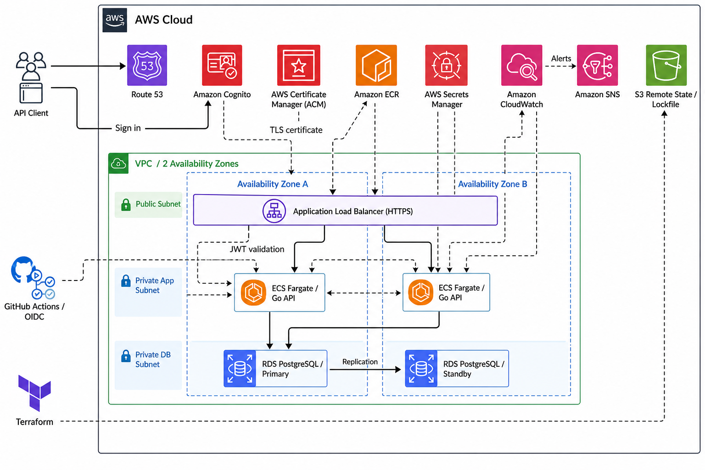

# AWS Production Web Platform

> 状態: 計画確定 / 実装未開始

Goで実装したタスク管理APIを題材に、データベース、認証、HTTPS、CI/CD、監視、バックアップ、復旧まで含めた本番想定AWS基盤を設計・構築するポートフォリオです。

短時間だけ実際に構築する`dev`環境と、本番要件を表現する`prod-reference`環境を分離します。`prod-reference`は原則として`terraform plan`までとし、費用を抑えながら本番設計との差分を説明できる構成にします。

## 証明する技術

- Go APIとPostgreSQLの設計・実装・テスト
- Terraformによる再現可能なAWS基盤とリモートステート運用
- パブリック、アプリケーション、データベース層の通信制御
- Cognito JWT認証、Secrets Manager、最小権限IAM
- GitHub Actions OIDCによる安全なCI/CD
- データベースマイグレーションと安全なローリングデプロイ
- CloudWatch、SNS、バックアップ、復旧試験
- コスト上限を設定した短時間検証と確実な後片付け

## 確定した主要構成

- Go REST API / PostgreSQL
- Amazon Cognito User Pool
- Application Load Balancer / ACM / Route 53
- Amazon ECS on AWS Fargate / Amazon ECR
- Amazon RDS for PostgreSQL / AWS Secrets Manager
- Amazon CloudWatch / Amazon SNS
- GitHub Actions OIDC
- Terraform S3 backend / S3 lockfile

## 構成図



## 環境方針

| 項目 | `dev` | `prod-reference` |
| --- | --- | --- |
| 用途 | 短時間の実動作検証 | 本番想定設計の確認 |
| 実際の構築 | 承認後に実施 | 原則`plan`のみ |
| ECS | 1タスク | 2タスク以上 |
| NAT Gateway | 1台 | AZごと |
| RDS | Single-AZ | Multi-AZ |
| 削除保護 | 無効 | 有効 |
| 検証後 | 同日中にdestroy | 構築しない |

## ローカル開発

### 前提ツール

- Go `1.26.4`
- Docker Desktop `28.x`
- Terraform `>= 1.15.0, < 1.16.0`
- Git

### PostgreSQLを起動する

```bash
cp .env.example .env
docker compose up -d postgres
docker compose ps
```

停止する場合:

```bash
docker compose down
```

データも削除する場合:

```bash
docker compose down -v
```

`.env`はローカル専用で、Git管理されません。`.env.example`の値は開発用であり、AWS環境では使用しません。

### MigrationとAPIを起動する

```bash
go run ./cmd/migrate
go run ./cmd/api
```

別のターミナルからhealth checkを確認します。

```bash
curl http://localhost:8080/health/live
curl http://localhost:8080/health/ready
```

ローカル開発ではBearer tokenの文字列を利用者IDとして扱います。

```bash
curl -X POST http://localhost:8080/api/v1/tasks \
  -H "Authorization: Bearer local-user-a" \
  -H "Content-Type: application/json" \
  -d '{"title":"Learn Go API","description":"Create first task"}'

curl http://localhost:8080/api/v1/tasks \
  -H "Authorization: Bearer local-user-a"
```

この開発用認証はローカル専用です。AWS環境ではCognito access token検証へ置き換えます。

### テスト

```bash
go test ./...
go test -tags=integration ./...
go vet ./...
```

## ディレクトリ構成

```text
cmd/api/      HTTP APIのエントリーポイント
cmd/migrate/  Migration専用エントリーポイント
internal/     認証、HTTP、task、設定
migrations/   PostgreSQL schema migration SQL
infra/        Terraform
private_docs/ Codex向け計画・TODO・学習資料（Git管理対象外）
```

## 現在の状態

- 計画と主要設計判断は`private_docs`へ整理済みです
- GitとローカルPostgreSQL開発基盤は準備済みです
- Go API、task CRUD、local migrationは実装済みです
- Cognito認証、Terraform、GitHub Actionsは未実装です
- AWSリソースは作成していません
- 次の実装作業は、コンテナとCI基盤です
